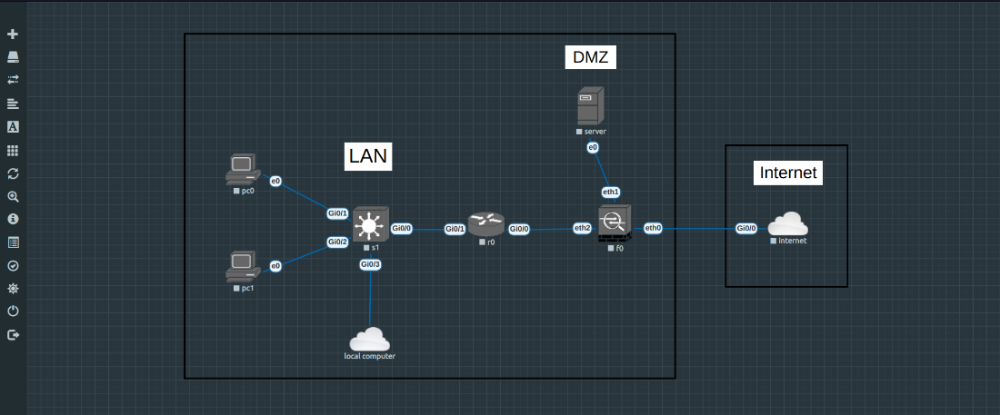
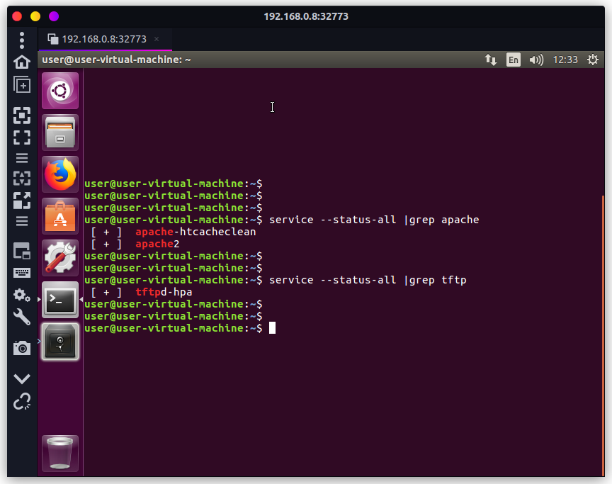

# Python_Automated_Network_Program

This is my practical about the automated network program with python.
The goal is make all the computer online and separate the network from LAN and DMZ. Use Py script to auto config to the 3 network device.

## How to use
1. Install eve-ng from VM or physical computer.
2. Setup eve-ng. Example import cisco image, IP route setting etc...
3. Import `_Exports_unetlab_export-20230613-144554.zip` to eve-ng.
4. Copy the command from config.ctb to the correspond network devices.
5. Excute the autoload.py with python3.

## The map of network
`local computer` is my laptop.
The ssh and Py script is execute form from the `local computer` to achieving script to load the configuration to network devices from LAN.



## DMZ server enable service
I run on 8G RAM old PC, so network device is not backup to the local server because my PC is non enough resource to emulate other server on eve-ng.



## How to expose ip for eve-ng emulated device
```
# show ip route
root@eve-ng:~# ip route
default via 192.168.0.1 dev pnetd
192.168.0.0/24 dev pnet0 proto kernel scope link src 192.168.0.8

# setup ip route and expose ip for eve-ng emulated device
root@eve-ng:~# ip route add 192.168.0.0/16 dev pnet0 proto kernel scope link src 192.168.0.8
root@eve-ng:~# ip route add 172.30.0.0/16 dev pnet0 via 192.168.10.1
root@eve-ng:~# ip route add 10.0.0.0/8 dev pnet0 via 192.168.10.1

# show ip route
root@eve-ng:~# ip route
192.168.0.1 dev pnetd
10.0.0.0/8 via 192.168.10.1 dev pnetd
172.30.0.0/16 via 192.168.10.1 dev pnetd
192.168.0.0/24 dev pnet0 proto kernel scope link src 192.168.0.8
192.168.0.0/16 dev pnet0 proto kernel scope link src 192.168.0.8
```
